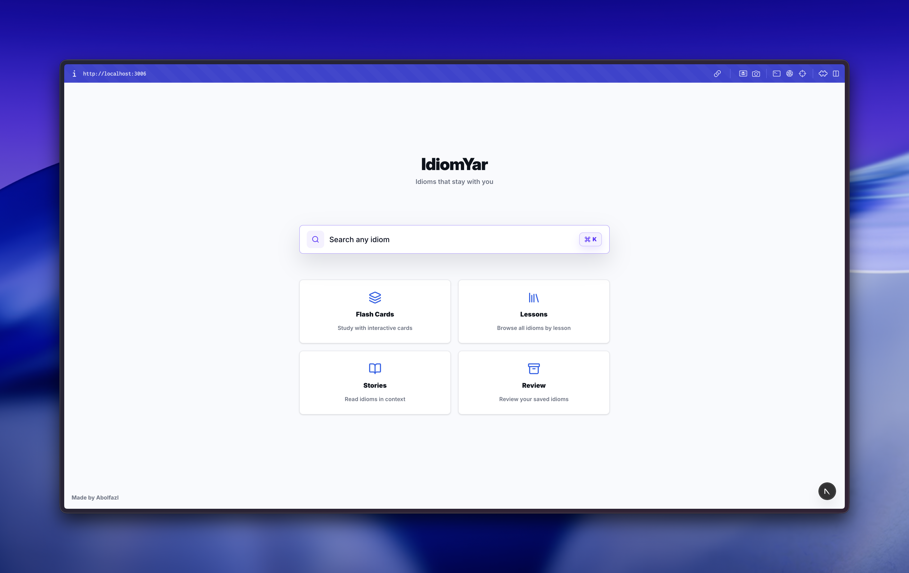
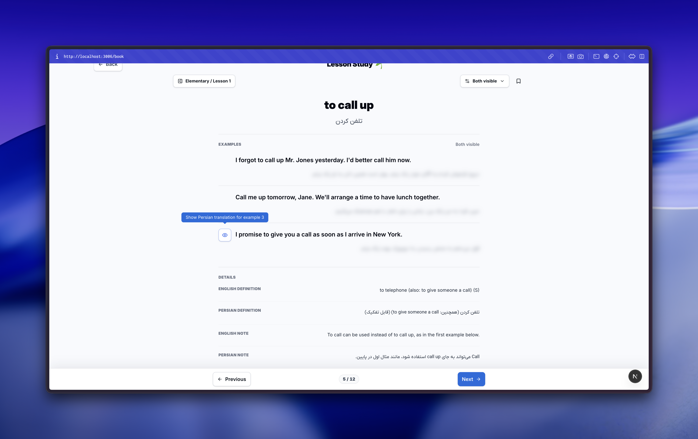
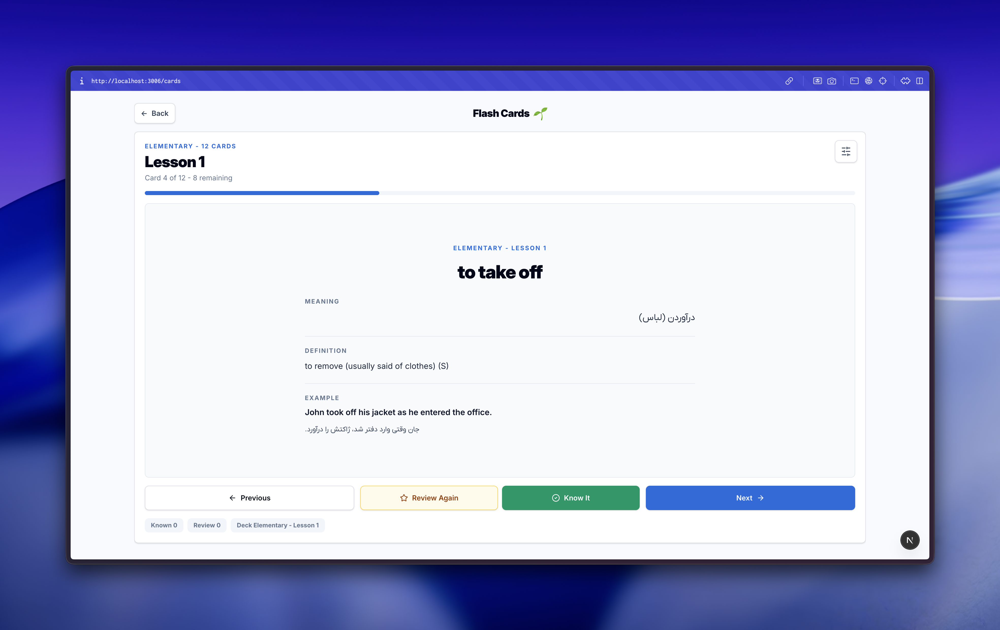
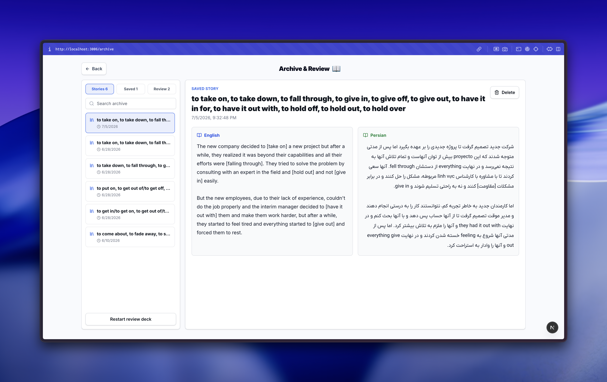

# IdiomYar

IdiomYar is a focused English idiom study app for learners who want to search, practice, understand, and reuse idioms in context. It combines lesson-based study, flash cards, AI-generated bilingual stories, and a saved review archive.

Built with Next.js, React, TypeScript, Tailwind CSS, and Groq.

<p align="center">
  
</p>

## Overview

IdiomYar helps learners move from passive recognition to active usage:

- Search idioms by phrase, meaning, level, or lesson.
- Study idioms level by level through guided lesson pages.
- Practice quick recall with flash cards.
- Generate short Persian and English stories from the lesson you are studying.
- Save generated stories, bookmarks, and difficult cards for later review.

## Screenshots

| Lesson Study | Flash Cards |
| --- | --- |
|  |  |

| Archive & Review |
| --- |
|  |

## Study Flow

1. Start from the home page and search for an idiom or choose a study mode.
2. Open Lesson Study to browse idioms by level and lesson.
3. Use the story icon on the current lesson to generate a short bilingual story.
4. Use Flash Cards to test recall and reinforce meaning.
5. Save stories and difficult idioms to Archive & Review.

## Features

### Home Search

The home page includes a fast idiom search experience that can find idioms by English phrase, Persian meaning, explanation, level, or lesson number.

### Lesson Study

Learners can browse structured idiom content across Elementary, Intermediate, and Advanced levels. Each lesson keeps idioms close to their definitions, meanings, and examples.

The lesson page can also generate a bilingual story from the idioms in the current lesson, then save it to the archive automatically.

### Flash Cards

Flash cards provide a focused review mode for quick recall. This is useful when learners want short practice sessions instead of reading full lesson context.

### Lesson Stories

Lesson stories turn the current lesson's idioms into a short bilingual story. The generated story keeps Persian and English paragraphs aligned so learners can compare meaning and usage naturally.

### Archive & Review

The archive stores saved stories, bookmarked idioms, and review cards so learners can return to difficult material later.

## Getting Started

Install dependencies:

```bash
bun install
```

Run the development server:

```bash
bun run dev
```

Open the app:

```text
http://localhost:3006
```

## Environment Variables

Story generation uses the Groq API. Create a local environment file and add your key:

```env
GROQ_API_KEY=your_groq_api_key_here
```

Without this key, the app can still load the study pages, but AI story generation will not be available.

## Scripts

```bash
bun run dev
bun run check
bun run build
bun run start
```

## Tech Stack

- Next.js 15
- React 19
- TypeScript
- Tailwind CSS 4
- Groq SDK
- TanStack Query
- Framer Motion
- Radix UI
- Lucide React

## Project Structure

```text
src/app/                 App routes and API routes
src/components/          Shared UI and feature components
src/components/story/    Story result components
src/data/                Idiom lesson data
src/hooks/               Reusable React hooks
src/lib/                 Idiom utilities and local storage helpers
public/screenshot/       README screenshots
docs/                    Product and implementation notes
```

## Documentation

- [Guided idiom study flow specification](docs/guided-idiom-study-flow-spec.md)
- [Landing refactor plan](docs/landing-refactor-plan.md)

## Roadmap Ideas

- Add spaced repetition for saved review cards.
- Add progress tracking by level and lesson.
- Add shareable story links.
- Add richer filters for idiom search.
- Add optional user accounts for synced progress.

## Author

Made by [Abolfazl](https://github.com/abolfazlj10).
